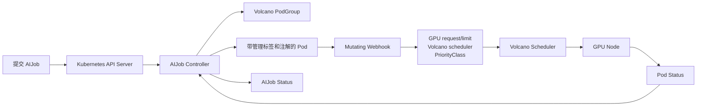

# AIJob Operator

AIJob Operator 是一个基于 Kubebuilder、controller-runtime 和 Volcano 的简易 GPU
任务 Operator。用户提交 `AIJob` 后，控制器创建 Volcano `PodGroup` 和工作 Pod，
Mutating Webhook 在 Pod 准入阶段注入整卡 GPU、Volcano scheduler 和 PriorityClass。

项目面向 Kubernetes 1.36，同时保留可配置的集群预检参数，方便在其他 GPU 集群中部署。

## 功能

- 提供 `ai.gpustack.io/v1alpha1` namespaced `AIJob` CRD。
- 一个 AIJob 管理一个 PodGroup 和一个工作 Pod。
- 自动注入 `nvidia.com/gpu` request 与 limit。
- 自动设置 `schedulerName: volcano`。
- 支持 `low`、`normal`、`high` 三档优先级。
- 支持 Volcano Queue、CPU/内存资源、节点选择、容忍和 RuntimeClass。
- 将 Pod 的 Pending、Running、Succeeded、Failed 状态同步到 AIJob。
- 使用 owner reference 在删除 AIJob 时级联清理 Pod 和 PodGroup。

## 工作链路



PodGroup 先于 Pod 创建，确保 Volcano admission 能找到任务所属的组。更完整的设计说明见
[架构与执行流程](docs/architecture.md)。

## 环境要求

- Kubernetes 1.36；其他版本需要自行核对依赖兼容性。
- Go 1.26，用于本地构建和测试。
- `kubectl`、`kustomize`、`controller-gen`、Docker、OpenSSL。
- GPU 节点已安装 NVIDIA 驱动和 NVIDIA Device Plugin。
- 集群能够识别 `nvidia.com/gpu`。
- Operator 镜像仓库能够被所有候选节点访问。

主要 Go 依赖：

- `sigs.k8s.io/controller-runtime v0.24.1`
- `k8s.io/api/apimachinery/client-go v0.36.0`

## 快速开始

### 1. 检查集群

```bash
kubectl config current-context
kubectl get nodes
kubectl get nodes -o custom-columns='NAME:.metadata.name,GPU:.status.allocatable.nvidia\.com/gpu'
kubectl get runtimeclass
```

确认当前 kubeconfig 指向目标集群，并且至少一个节点显示可分配 GPU。

### 2. 获取代码并运行测试

```bash
git clone https://github.com/oyyyyy61/ai-job-Operator.git
cd ai-job-Operator
make test
```

`make test` 会生成 CRD、RBAC 和 DeepCopy 代码，然后运行格式化、`go vet` 和单元测试。

### 3. 安装 Volcano

```bash
./scripts/install-volcano.sh
```

脚本默认使用与 Kubernetes 1.36 验证过的 Volcano commit。也可以显式指定版本或本地清单：

```bash
VOLCANO_REF=<reviewed-commit-or-tag> ./scripts/install-volcano.sh
VOLCANO_MANIFEST=/path/to/volcano.yaml ./scripts/install-volcano.sh
```

### 4. 构建并推送 Operator 镜像

```bash
export IMG=registry.example.com/aijob-operator:v0.1.0
make docker-build IMG="$IMG"
make docker-push IMG="$IMG"
```

私有仓库需要提前为集群配置 `imagePullSecrets` 或节点级仓库凭据。本项目当前 Manager
清单没有暴露 `imagePullSecrets` 参数，最简方式是使用节点可直接访问的仓库。

### 5. 部署并验证

```bash
IMAGE="$IMG" ./scripts/deploy.sh
./scripts/verify.sh
```

可以通过环境变量增加目标集群保护和节点检查：

```bash
EXPECTED_API_SERVERS=https://192.168.50.11:6443,https://192.168.50.12:6443 \
EXPECTED_NODES=gpu-node-14,gpu-node-15,gpustack-cp01,gpustack-cp02 \
GPU_NODES=gpu-node-14,gpu-node-15 \
MIN_GPU_PER_NODE=1 \
IMAGE="$IMG" \
./scripts/deploy.sh
```

`EXPECTED_API_SERVERS`、`EXPECTED_NODES` 和 `GPU_NODES` 都是可选参数。部署脚本会安装
PriorityClass、CRD、RBAC、Manager、Webhook Service，生成 Webhook TLS 证书并写入
CA bundle。

完整安装说明和镜像仓库注意事项见 [部署指南](docs/deployment.md)。

### 6. 提交一个 AIJob

```bash
kubectl apply -f config/samples/ai_v1alpha1_aijob.yaml
kubectl get aijob,pod,podgroup -w
```

示例会申请一张 NVIDIA GPU，执行 `nvidia-smi`，然后等待 20 秒。查看结果：

```bash
kubectl logs cuda-smoke-high
kubectl get aijob cuda-smoke-high -o yaml
kubectl get pod cuda-smoke-high \
  -o jsonpath='{.spec.schedulerName}{"\n"}{.spec.priorityClassName}{"\n"}{.spec.containers[0].resources}{"\n"}'
```

预期 Pod 包含：

```yaml
spec:
  schedulerName: volcano
  priorityClassName: ai-high
  containers:
  - name: worker
    resources:
      requests:
        nvidia.com/gpu: "1"
      limits:
        nvidia.com/gpu: "1"
```

删除示例：

```bash
kubectl delete -f config/samples/ai_v1alpha1_aijob.yaml
```

AIJob 字段、状态和优先级演示见 [使用指南](docs/usage.md)。

## 项目目录

```text
api/v1alpha1/       AIJob Go 类型、校验规则和生成代码
controllers/        AIJob Reconcile 控制逻辑
webhooks/           Pod Mutating Webhook
config/crd/         生成的 CRD
config/rbac/        Controller、编辑者和只读用户权限
config/manager/     Operator Deployment
config/webhook/     Webhook Configuration 和 Service
config/scheduler/   low、normal、high PriorityClass
config/samples/     冒烟测试和优先级演示
docs/               架构、部署、使用和排障文档
scripts/            Volcano 安装、Operator 部署和验证脚本
```

## 常用开发命令

```bash
make manifests       # 生成 CRD、RBAC 和 Webhook 清单
make generate        # 生成 DeepCopy 代码
make fmt             # 格式化 Go 代码
make vet             # 静态检查
make test            # 生成代码并运行全部测试
make build           # 构建 bin/manager
make docker-build IMG=<image>
make docker-push IMG=<image>
make deploy IMG=<image>
make verify
```

## 当前边界

- 一个 AIJob 只创建一个工作 Pod，适合单机单卡或单机多卡任务。
- 使用 `nvidia.com/gpu` 整卡资源，不包含 MIG、vGPU 和显存切分。
- `priority` 默认实现等待队列排序；当前 Volcano 配置未启用运行中任务抢占。
- 没有失败重试上限、最大运行时间、暂停、历史清理和分布式训练编排。
- Webhook 使用部署时生成的 365 天自签名证书。
- 示例会真实申请 GPU，执行前应检查节点上已有的训练、推理和桌面图形负载。

遇到 `ImagePullBackOff`、Webhook TLS、Pod Pending 或 Volcano Queue 问题时，查看
[排障指南](docs/troubleshooting.md)。

## License

Apache License 2.0，见 [LICENSE](LICENSE)。
