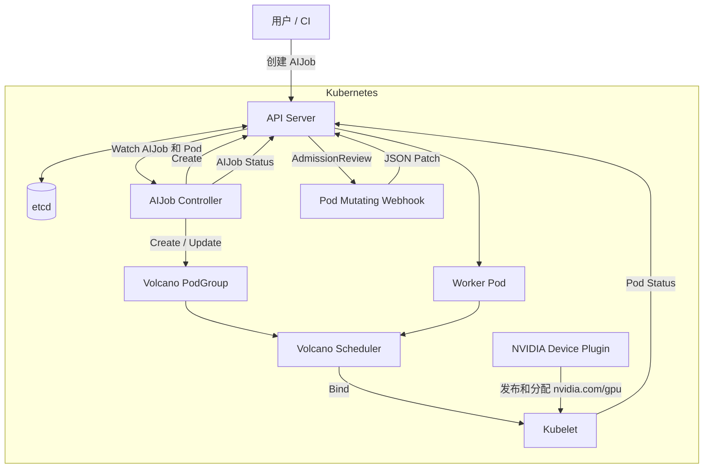
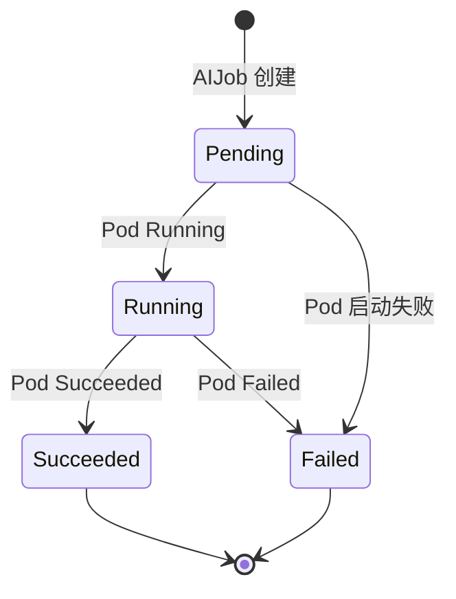

# 架构与执行流程

## 组件关系

AIJob Operator 由一个 controller-runtime Manager 承载。Manager 内同时运行 AIJob
Controller、Pod Mutating Webhook、健康检查和指标端点。



## Kubebuilder 分层

### API 层

`api/v1alpha1/aijob_types.go` 定义用户可以声明的期望状态和 Controller 返回的运行状态。
Kubebuilder markers 负责生成：

- OpenAPI v3 schema。
- 默认值和枚举校验。
- `status` 子资源。
- `kubectl get aijob` 打印列。
- `spec` 不可变规则。

生成结果位于 `config/crd/bases/ai.gpustack.io_aijobs.yaml`。`zz_generated.deepcopy.go`
提供 controller-runtime 缓存和客户端需要的深拷贝实现。

### Manager 层

`main.go` 完成以下初始化：

1. 将 Kubernetes 核心类型和 AIJob 类型注册到 Scheme。
2. 创建 controller-runtime Manager。
3. 注册 AIJob Controller。
4. 注册 `/mutate-v1-pod` Webhook handler。
5. 注册 `/healthz` 和 `/readyz`。
6. 启动共享缓存、Controller workers、Webhook Server 和 leader election。

Controller 与 Webhook 使用同一份 Scheme、API Client 和进程生命周期。

### Controller 层

`controllers/aijob_controller.go` 的 `Reconcile()` 以 AIJob 的 namespace/name 为输入。
每次调谐执行以下逻辑：

1. 读取 AIJob；对象已经删除时结束。
2. 计算期望 PodGroup。
3. 创建或修正 PodGroup。
4. 读取同名 Pod。
5. Pod 缺失时生成并创建 Pod。
6. 校验已有 Pod 和 PodGroup 是否由当前 AIJob 控制。
7. 根据 Pod 状态更新 AIJob status。

PodGroup 关键字段：

```yaml
spec:
  minMember: 1
  minResources:
    nvidia.com/gpu: "1"
  priorityClassName: ai-normal
  queue: default
```

Controller 生成的原始 Pod 带有以下标记：

```yaml
metadata:
  labels:
    ai.gpustack.io/managed: "true"
  annotations:
    ai.gpustack.io/gpu-count: "1"
    ai.gpustack.io/priority: normal
    scheduling.k8s.io/group-name: <aijob-name>
```

GPU resources 由 Webhook 在 API Server 保存 Pod 前写入。

### Webhook 层

`webhooks/pod_mutator.go` 只处理带 `ai.gpustack.io/managed=true` 的 Pod。它会：

1. 校验 GPU 数量为 1-8。
2. 校验优先级为 low、normal 或 high。
3. 查找名为 `worker` 的容器。
4. 写入相同的 GPU request 和 limit。
5. 设置 `schedulerName: volcano`。
6. 设置 PriorityClass 和对应的整数优先级。

Webhook 使用 JSON Patch 返回修改结果。`failurePolicy: Fail` 确保管理 Pod 在注入失败时不会
绕过 GPU 和调度配置进入集群。

### 调度层

Volcano 同时读取 PodGroup 和 Pod：

- `gang` plugin 检查 PodGroup 是否满足最小成员和资源条件。
- `priority` plugin 使用 PriorityClass 排序等待任务。
- `predicates`、`nodeorder` 和 `binpack` 等插件选择节点。
- kubelet 调用 NVIDIA Device Plugin 分配具体 GPU。

当前 AIJob 只有一个 worker，所以 `minMember=1`。后续支持分布式训练时，可以按 replicas
创建多个 Pod，并将 `minMember` 调整为 gang size。

## 状态流转



Controller 将 Pod 的调度消息、节点名、开始时间和结束时间写入 AIJob status。Pod 的状态
变化会触发新的 Reconcile。

## 所有权与删除

Pod 和 PodGroup 都包含指向 AIJob 的 controller owner reference。删除 AIJob 后，
Kubernetes garbage collector 会清理这两个从属资源。资源名称冲突且 owner reference 不匹配
时，Controller 会拒绝接管并记录 `ResourceCollision`。

## 目录职责

```text
api/v1alpha1/       API 类型、Scheme 和 DeepCopy
controllers/        Reconcile 和状态同步
webhooks/           Pod admission mutation
config/crd/         CRD 输出
config/rbac/        ServiceAccount、ClusterRole 和 bindings
config/manager/     Operator Deployment
config/webhook/     Webhook Configuration、selector 和 Service
config/scheduler/   PriorityClass
config/samples/     可运行样例
scripts/            安装、部署和验证流程
```

## 测试边界

- `controllers/aijob_controller_test.go` 使用 fake client 验证 PodGroup、Pod 和状态生成。
- `webhooks/pod_mutator_test.go` 验证 GPU 注入、优先级和幂等性。
- `scripts/verify.sh` 使用 API Server dry-run 验证 CRD 和真实 Webhook 链路。
- `config/samples/priority-demo.yaml` 用于验证真实 GPU 排队顺序。
